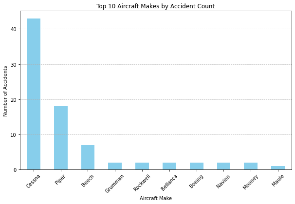
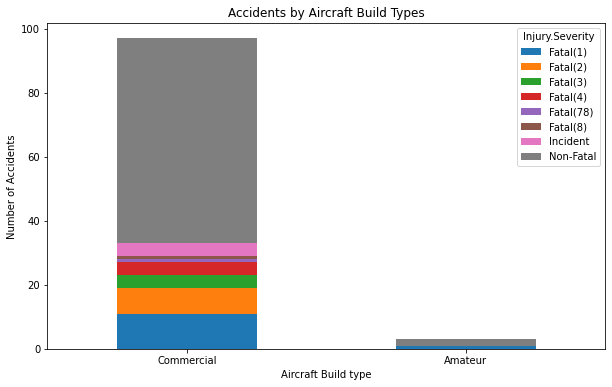

## dsc-Phase-1-project
Aircraft risk analysis for Portfolio expansion
## Project Overview
This project analyzes aircraft accident data from 1962 to 2023 to provide actionable insights for companies seeking to purchase and operate aircraft for commercial or private enterprise use.

The goal is to identify lower-risk aircraft based on accident history, injury severity, structural damage outcomes, and weather-related risksand other related factors  supporting informed decision-making for aviation procurement.

# Business Understanding
- The aviation industry is increasingly focusing on safety and cost-efficiency, especially when expanding its aircraft portfolio. Making well-informed procurement decisions based on aircraft safety and risk data is critical to reducing injury-related costs, operational disruptions, and insurance premiums.
- This project aims to analyze past aircraft incidents, injuries, and damage patterns to guide smarter, safer aircraft purchases. The goal is to ensure that our growing fleet of aircraft operates with the lowest possible risk and maximum cost efficiency.
- By identifying risk factors related to different aircraft models, we can make informed decisions that minimize long-term injury costs, maintenance risks, and operational disruptions.
# Data Understanding and Analysis
 - Aviation.csv Dataset containing a dataset from National Transportation Safety Board hat includes aviation accident data from 1962 to 2023 about civil aviation accidents and selected incidents in the United States and international waters.
# importing necessary libraries
import pandas as pd
import numpy as np
import matplotlib.pyplot as plt
### Loading the dataset
df=pd.read_csv("AviationData.csv",nrows=100,skiprows=0)
df.head()
### Establish data types in each column
df.dtypes

### List the columns for reference
df.columns

### Understand the data structure, check Missing Values and Memory Usage
df.info()

### Drop accidents with 90% of data missing
df = df.dropna(axis=1,thresh=int(.90*len(df)))
df

### Grouping by Make and model to get accident counts
Make_accidents =df.groupby("Make")["Event.Id"].count().sort_values(ascending=False)
Make_accidents

 # Plotting Top 10 makes by number of accidents
 top_makes =Make_accidents.head(10)

top_makes.plot(kind="bar",figsize=(10,6), color ="Skyblue")
plt.title("Top 10 Aircraft Makes by Accident Count")
plt.ylabel("Number of Accidents")
plt.xlabel("Aircraft Make")
plt.xticks(rotation=45)
plt.grid(axis="y",linestyle="--", alpha=0.7)
plt.show

 

 # GOAL 2 __Amateur-built vs Commercial Aircraft Risk__
- To establish whether Amateur built aircraft are riskier than commercially built ones

### checking ameteur counts based on ameteur built Status
amateur_counts =df["Amateur.Built"].value_counts()
amateur_counts
Amateur.Built
No     97
Yes     3
Name: count, dtype: int64
 # Plotting accidents by Aircraft build types
 amateur_severity.plot(kind="bar",stacked=True, figsize=(10,6))
plt.title("Accidents by Aircraft Build Types")
plt.ylabel("Number of Accidents")
plt.xlabel("Aircraft Build type") #Yes =Amateur, # No=Commercial
plt.xticks(ticks=[0,1], labels=["Commercial", "Amateur"], rotation=0)
plt.show
 
 # # Establish the relationship between the severity of the injuries, how the aeroplane is damaged and the Total.Serious.Injuries, Total.Minor.Injuries, Total.Uninjured
# Compare the injury severity, and how the airplane was damaged to see the association with the average minor injuries in the damaged plane

df.groupby(['Injury.Severity','Aircraft.damage'])['Total.Minor.Injuries'].mean()

Injury.Severity  Aircraft.damage
Fatal(1)         Destroyed          0.090909
Fatal(2)         Destroyed          0.000000
Fatal(3)         Destroyed          0.000000
Fatal(4)         Destroyed          0.250000
Fatal(78)        Destroyed          3.000000
Fatal(8)         Destroyed          0.000000
Incident         Minor              0.000000
Non-Fatal        Destroyed          0.625000
                 Substantial        0.350877
Name: Total.Minor.Injuries, dtype: float64

# Compare the injury severity and how the airplane was damaged to see the association with the average fatal injuries in the damaged plane
df.groupby(['Injury.Severity','Aircraft.damage'])['Total.Fatal.Injuries'].mean()

Injury.Severity  Aircraft.damage
Fatal(1)         Destroyed           1.0
Fatal(2)         Destroyed           2.0
Fatal(3)         Destroyed           3.0
Fatal(4)         Destroyed           4.0
Fatal(78)        Destroyed          78.0
Fatal(8)         Destroyed           8.0
Incident         Minor               0.0
Non-Fatal        Destroyed           0.0
                 Substantial         0.0
Name: Total.Fatal.Injuries, dtype: float64

# Compare the injury severity and how the airplane was damaged to see the association with the average Uninjured in the damaged plane
df.groupby(['Injury.Severity','Aircraft.damage'])['Total.Uninjured'].mean()

Injury.Severity  Aircraft.damage
Fatal(1)         Destroyed          0.000000
Fatal(2)         Destroyed          0.000000
Fatal(3)         Destroyed          0.000000
Fatal(4)         Destroyed          0.000000
Fatal(78)        Destroyed          0.000000
Fatal(8)         Destroyed          0.000000
Incident         Minor              1.333333
Non-Fatal        Destroyed          1.000000
                 Substantial        2.465517
Name: Total.Uninjured, dtype: float64

# Compare the type of flight undertaken resultant  severity of the  injury vis-vis the average fatal injuries, uninjured and minor injuries by creating a pivot table to see the relationship
df.groupby(['Purpose.of.flight','Injury.Severity'])[['Total.Fatal.Injuries','Total.Uninjured','Total.Minor.Injuries']].mean()

# # Establish the relationship between the weather conditions and injuries recorded
df.groupby(['Weather.Condition','Injury.Severity'])[['Total.Fatal.Injuries','Total.Uninjured','Total.Minor.Injuries']].mean()

 # # Establish the relationship between the make of the aeroplane,engine type and the injuries recorded
 df.groupby(['Make','Engine.Type','Injury.Severity'])[['Total.Fatal.Injuries','Total.Uninjured','Total.Minor.Injuries']].mean()    
    

 #### Key Findings
- Injury severity is strongly correlated with aircraft damage levels.
- Weather conditions significantly affect accident severity.
- Certain aircraft makes have disproportionately higher accident and fatality rates.
- Commercially manufactured aircraft exhibit higher injury outcomes compared to amateur-built models (limited data on amateur builds).
- Engine type and aircraft make combinations impact injury outcomes.
# Recommendations
- The Cessna type of aircraft had more injuries than any other model .
- Aircraft with reciprocating engine types caused more injuries.
- Select aircraft certified for all-weather operations to mitigate weather-related risks.

---

## Contact
**[Leah Mukundi]**
Aviation Risk Analysis Consultant
**Email:** [mukundileah@gmail.com]
**LinkedIn:** [linkedin.com/in/leahmukundi]